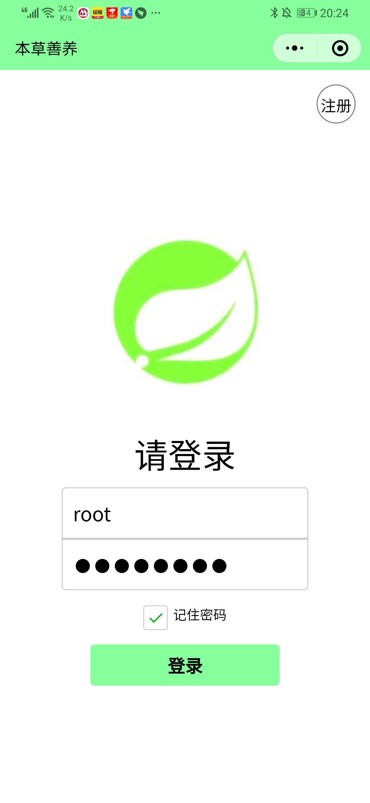
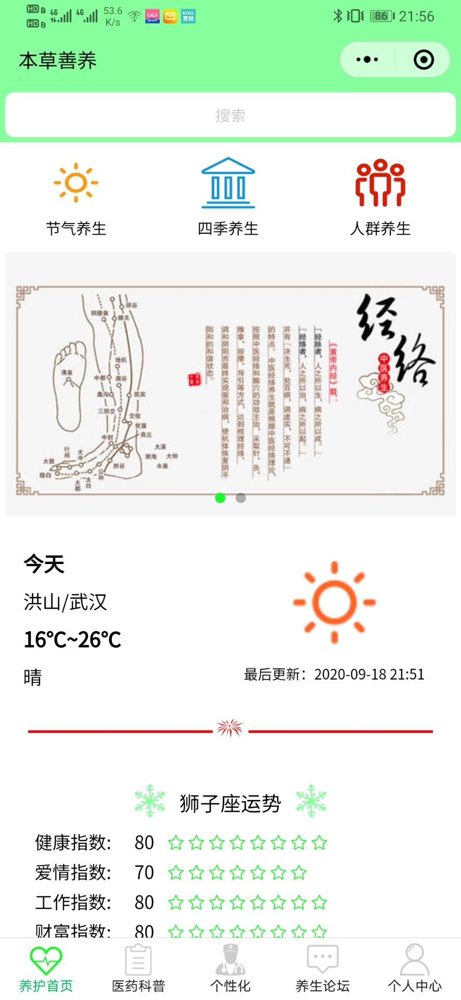
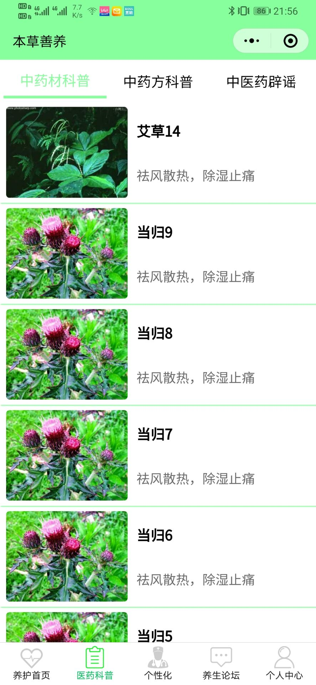
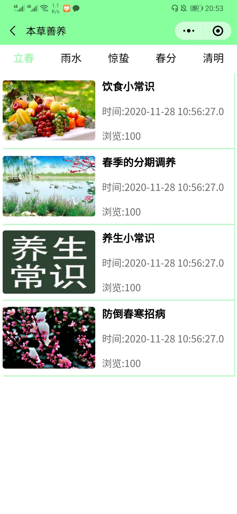
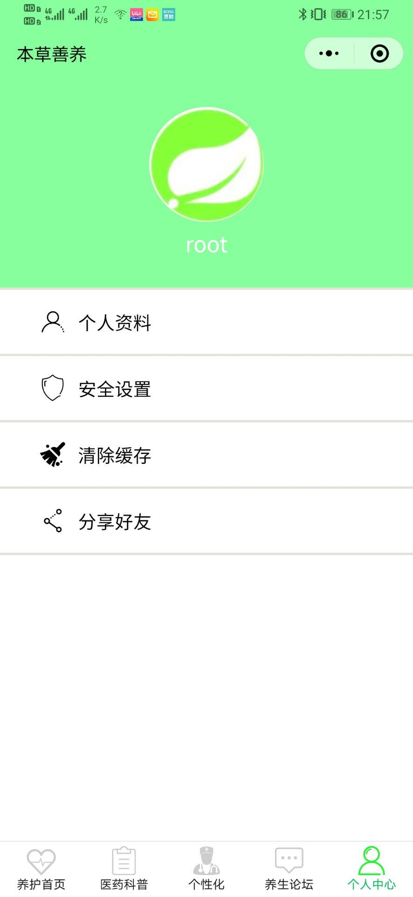
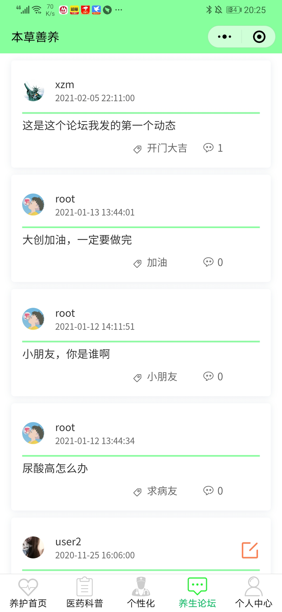
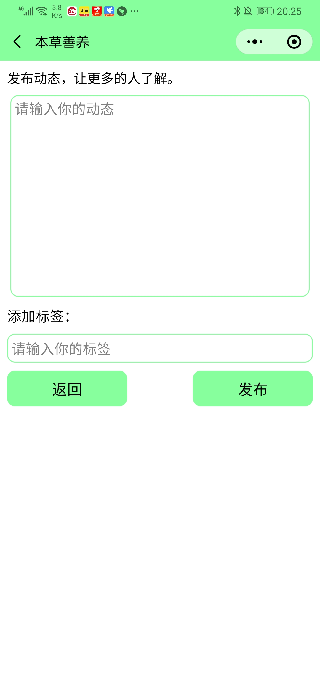

# medicineapp_wx

此为 **本草善养** 小程序，账号中有后端分享代码 [后端分享链接](https://github.com/CSerxzm/medicineapp)，用于得到后端数据。

#### 注意
运行前端前需要运行后端，否则得不到数据。对于上面数据库，以及小程序中的以下界面，在文件夹中 pic/pic_medicineapp 中，在运行的时候需要将该文件夹 pic_medicineapp 放入到tomcat容器中。

当手机真机调试，预览，提示包过大，可以删除pic文件夹来解决该问题。

有疑问可联系QQ 3052720966

#### 功能

- 有获得中草药的相关信息
- 按季节、人群、节气获得养生知识
- 根据自己的状态，提供食疗方案
- 提供论坛功能，提供动态的发表和评论

#### 部分界面

